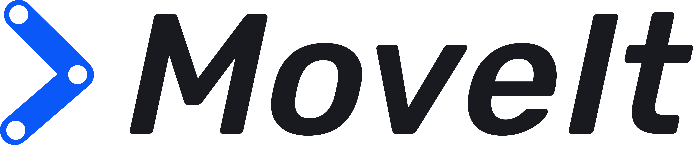
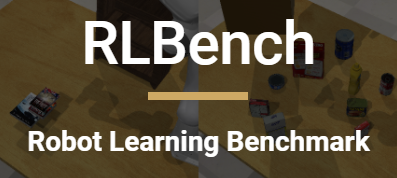

# ARCL Robothon Team_A

#### Members : Hwasung (Mars) Seo, Ralf Römer, Pierre Reboud, Andres Gonzalez.

## Task 1 - Self Collision

### 1.1 Check self-coliison from specific joint configuration - Pierre Reboud
>[Task 1.1](https://gitlab.lrz.de/arcl21/team_a/-/tree/main/Task11)
### 1.2 Indentify and avoid self-collision from given joint and Cartesian trajectories - Hwasung (Mars) Seo
>[Task 1.2](https://gitlab.lrz.de/arcl21/team_a/-/tree/main/Task12)   
#### Task 1 is based on ROS by using MoveIt and Rviz.
</img> &nbsp;&nbsp;&nbsp;
</img>&nbsp;&nbsp;&nbsp;
</img>     
   
## Task 2 - Obstacle Avoidance

### 2.1 End-effector trajectory planning - Ralf Römer
>[Task 2.1](https://gitlab.lrz.de/arcl21/team_a/-/tree/main/Task21)
### 2.2 Joint obstacle avoidance - exploiting null space - Ralf Römer
>[Task 2.2](https://gitlab.lrz.de/arcl21/team_a/-/tree/main/Task22)
### 2.3 Learning - vision-based obstacle avoidance (RLBench) - Andres Gonzalez
>[Task 2.3](https://gitlab.lrz.de/arcl21/team_a/-/tree/main/Task23)   
#### Task 2 is based on CoppeliaSim (lua, Matlab API and python) and Matlab with the Robotics System Toolbox (Task 2.2)
</img>&nbsp;&nbsp;&nbsp;
</img>&nbsp;&nbsp;&nbsp;
</img>
