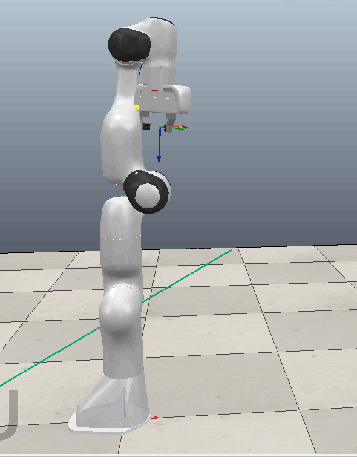
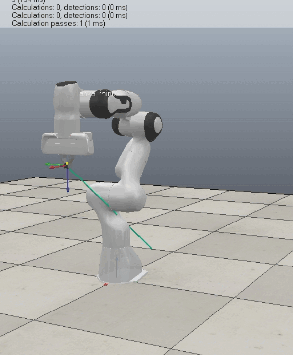

# Robothon Description

Detailed description of Robothon task for Advanced Robot Control WS2021-2022

For all tasks, the initial joint pose (if required) of the robot is always q_start. And for naming scheme/convention, variable orders, etc., please follow the libfranka document, especially the [RobotState](https://frankaemika.github.io/libfranka/structfranka_1_1RobotState.html) class description to avoid confusions. 

``` c++
q_start = {{0, -M_PI_4, 0, -3 * M_PI_4, 0, M_PI_2, M_PI_4}} // M_PI_4 = Pi/4; M_PI_2 = Pi/2; 
```

**Each team has been invited to its own repository for code developing, documentation and result submission, please keep it updated with your latest progress.**

## Robothon Simulation Task 1 - Self-Collision Avoidance

### 1. Check self-collision from specific joint configuration

Please indicate whether there are self-collision for the joint poses in [self_collision_specific_joint_poses.data](Task_1/self_collision_specific_joint_poses.data) (each line represents a specific joint configuration - q in JSON format). 

If there exist self-collision scenarios in specific joint pose, please indicate the collision groups (which joint links are collided). 

Examples are shown below, such as for joint pose q_example, the gif shows the recovery from the initial self-collision state (link 6 collides with gripper - yellow contact points). 

``` json
{"q_example": [-0.015896176064967, 0.0064190366448024, -0.0075707499149116, -0.035205070178435, 0.010341694431194, 0.0093508241818754, 0.043023672042527]}
```



The example result file should indicate the self-collision exists and the collision groups such as the following

``` json
{
    "collision": true,
    "collision groups" : {"1": "Franka_link6 FrankaGripper"}
}
```

### 2. Identify and avoid self-collision from given joint and Cartesian trajectories

For joint trajectories, please first verify if the target joint pose in [self_collision_specific_joint_poses.data](Task_1/self_collision_specific_joint_poses.data) (q as q_d) is reachable. Please also indicate whether there is any self-collision happens in normalized trajectories from the initial joint pose to the target joint poses. Here normalized trajectories mean the joint motion is synchronized proportionally. If self-collision happens, plan a joint pose trajectory to avoid the self-collision. 

For Cartesian trajectories, please also first verify if the target Cartesian pose in [self_collision_target_cartesian_poses.data](Task_1/self_collision_target_cartesian_poses.data) (O_T_EE_d) is reachable, then check the linear trajectory from the initial Cartesian pose to the target Cartesian pose if any self-collision happens. If self-collision happens, plan a Cartesian pose trajectory and corresponding joint trajectory to avoid the self-collision. 

An example is shown as below, such as for the Cartesian pose O_T_EE_d_example, green path indicates the linear trajectory to the target Cartesian pose which is not valid, the following gif shows a planned trajectory to avoid self-collision. 

``` json
{"O_T_EE_d_example": [0.7103, -0.07768, 0.6996, 0, 0.06101, 0.9969, 0.04874, 0, -0.7013, 0.008062, 0.7129, 0, -0.216, 0.04661, 0.5734, 1]}
```



Please also analyse the resulted planned trajectory based on the metrics defined by your team. 

### Reference

1. [libfranka](https://frankaemika.github.io/docs/libfranka.html)

2. [CoppeliaSim User Manual](https://www.coppeliarobotics.com/helpFiles/index.html)

3. [Open Motion Planning Library - OMPL](http://ompl.kavrakilab.org/) (Already implemented in CoppeliaSim)

4. [The Flexible Collision Library - FCL](https://github.com/flexible-collision-library/fcl#fcl----the-flexible-collision-library) 

5. [**Other libraries collection and literature**](https://github.com/jslee02/awesome-collision-detection)

### Note

Additional [joint poses data](Task_1/self_collision_specific_joint_poses.data), [Cartesian poses data](Task_1/self_collision_target_cartesian_poses.data) have been **updated**.

As long as you can justify the methods and others are able to recreate the achieved results, you are welcome to use other simulators/physics engines like [Matlab](https://www.mathworks.com/help/robotics/ref/importrobot.html#bvlvwcs-1-filename), [Gazebo](http://gazebosim.org/), [MuJoCo](https://mujoco.org/), [Webots](https://cyberbotics.com/), [RoboDK](https://robodk.com/index), etc. 

## Robothon Simulation Task 2 - Obstacle Avoidance

### 1. End-effector trajectory planning

The [scene](Task_2/reach_cylinder.ttt) and the corresponding [drawing](Task_2/reach_cylinder.pdf) with dimensions is provided for you to test the obstacle avoidance algorithm. Try to control the robot end-effector to grasp the cylinder without colliding. **[Scene 2](Task_2/reach_cylinder_cluttered.ttt) with corresponding [object infos](Task_2/reach_cylinder_cluttered.txt) is also uploaded.** 

### 2. Joint obstacle avoidance - exploiting null space 

Consider when grasping the cylinder (fixed end-effector pose), an additional sphere (r = 0.02m) appears randomly in the simulation environment. Please verify if there is any valid joint configuration to avoid colliding for each sphere position (spatial resolution = 0.005m). 

### 3. Learning - vision-based obstacle avoidance (RLBench)

The learning framework [RLBench](https://github.com/stepjam/RLBench) is selected. Try out the [reach_target](https://github.com/stepjam/RLBench/blob/master/rlbench/tasks/reach_target.py) task with different learning methods based on camera perception. Compare your trained models based on the metrics defined by your team, such as success rate under various initial locations for the target. And try to validate the robustness of your trained model under various conditions such as partially obscured target object, limited camera perception input, etc. (**To reduce the workload, no extra task will be given for the learning part**)

### Note 

For the learning part, you do require a CUDA supported GPU to start the learning process. 

## FAQ

### 1. What metric should we use to benchmark our collision detection and motion planning implementations?

For metrics that benchmark the self-collision detection, success rate (if and where), accuracy (spatial resolution, minimum detection range) and time and space complexity (required time and storage for calculation). As for motion planning implementations, required time duration, overall travel distance(self/obstacle collision avoidance), motion accuracy and smoothness, time and space complexity (realtime or offline) and stability. Most of these metrics listed above are optional/selectable ones, each team can define their specific combinations. 

### 2. How low level do you expect us to implement our own solutions? Could you be more precise on which components of the controller you expect us to implement with own solutions or off-the-shelf libraries?

We would expect you to provide a detailed and comprehensive solution more than a completely self-implemented solution which will be finally presented and evaluated. You are welcome to use existing libraries to reduce the development time and avoid repetitive work. And in the meantime try to understand in-depth how these existing libraries/core algorithms work instead of just being an API user. Of course, developing all by your team would exhibit the efforts though practically probably not viable due to the time limit. For example, in calculating self-collision, it's definitely reasonable and preferred to use existing libraries to calculate minimal distances between geometries/point clouds. 

