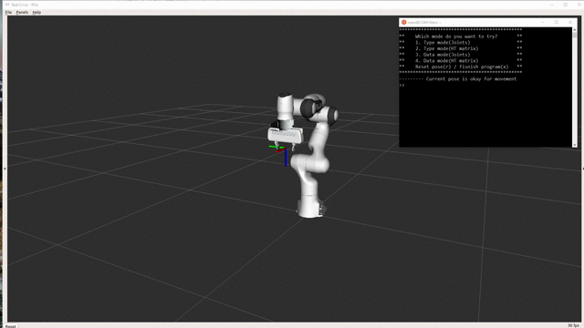
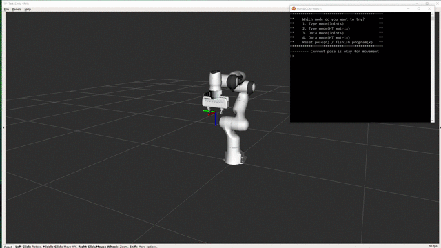

# Task 1.2 Indentify and avoid self-collision from given joint and Cartesian trajectories

### Before lanuch my package, you must install packages by using commands below.
    sudo apt-get install ros-melodic-desktop-full
    sudo apt-get install ros-melodic-moveit && ros-melodic-moveit-visual-tools && ros-melodic-franka* && ros-melodic-panda-moveit-config

### And then you can build my package using catkin.
    catkin build Task12

### Then, command below for launching my package.
    roslaunch Task12 moveit_panda.launch

### In another terminal you should run for my custom node.
    rosrun Task12 task1_2_node

## Example running mode 3

## Example running mode 4
