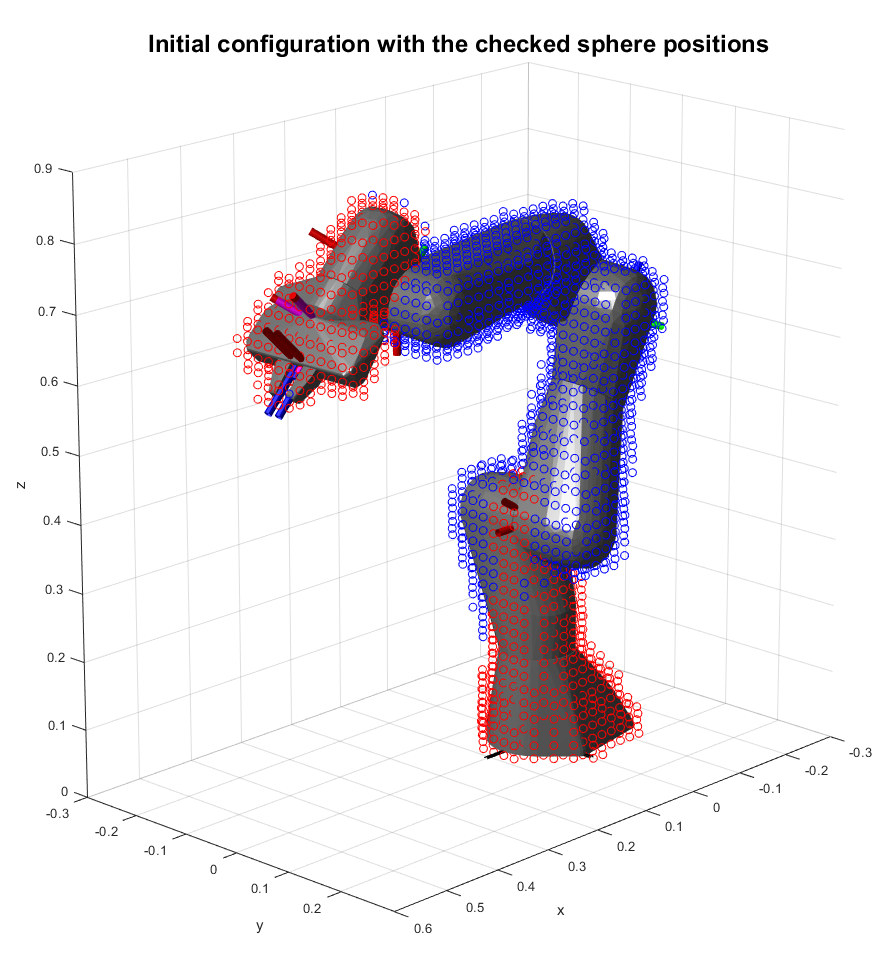
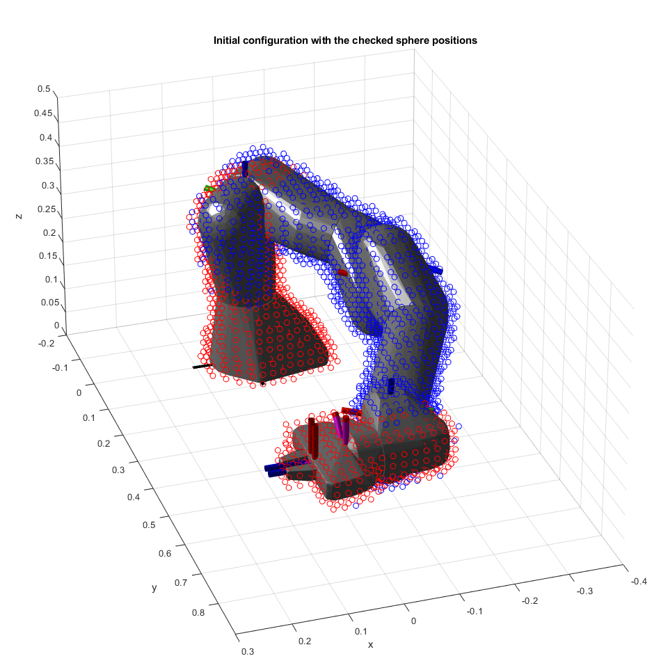

# Task 2.2
Task 2.2 is solved by using Matlab with the [Robotics System Toolbox](https://de.mathworks.com/products/robotics.html). The main motivation for choosing Matlab was to facilitate the visualization of the results of this task.

## Nullspace Exploration
We explored the nullspace by using the right pseudo-inverse of the Jacobian J(q) as described for example in [Siciliano et al., Robotics: Modelling, Planning and Control](https://link.springer.com/book/10.1007/978-1-84628-642-1). By this, we obtained a joint velocity yielding no end-effector motion. Defining a system of nonlinear differential equations with the state q, the initial grasping configuration as the initial value and the state dynamics given by the obtained expression for the joint velocity delivered a joint trajectory covering the whole nullspace (See for example [nullspace exploration](figs/nullspace_configs.fig)).

## Collision Checking
Since the aforementioned approach was purely kinematic, we checked the obtained nullspace configurations for self-collision and for collision with the spheres and kept only the collision-free ones. Finally, we sampled the whole workspace for sphere positions. If the sphere is in collision with the robot, then the kept nullspace configurations are checked for a collision with the sphere until either a collision-free one is found or all nullspace configurations have been checked. Finally, we visualized the results as shown below. Here, the spatial resolution is chosen as 0.02 m. Results for higher resolutions are contained in [figs](figs).

